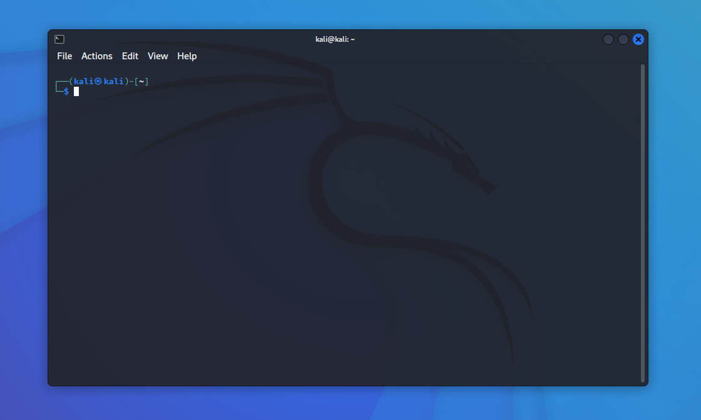

# Лабораторная работа № 1. Права доступа Kali Linux.

1. Лабораторная работа выполняется на ОС Kali Linux. В работе используется консоль (терминал). Вызвать ее возможно,
   например, перейдя в пункт приложения и найти там терминал.
   
2. Предварительно проверьте наличие других учетных записей (не root). Удалите их. Для исследования файловых объектов вам
   потребуются еще два пользователя, учетные записи которых предстоит создать. Для этого воспользуйтесь краткой формой
   команды useradd –m user1 Аргумент –m предписывает создание домашнего каталога пользователя с его именем. После этого
   пользователю необходимо присвоить пароль. Это делается командой passwd user1 На запрос введите простой пароль
   1234567890.

```shell
 ┌──(kali㉿kali)-[~]
 └─$ users
 kali
 
 ┌──(kali㉿kali)-[~]
 └─$ sudo useradd -m user1
 
 ┌──(kali㉿kali)-[~]
 └─$ sudo passwd user1
 New password: 
 Retype new password: 
 passwd: password updated successfully
```

3. Повторите команды п. 2 для создания учетной записи пользователя user2. Помните, что оба пользователя по умолчанию
   являются членами одной группы users.

```shell
┌──(kali㉿kali)-[~]
└─$ sudo useradd -m user2

┌──(kali㉿kali)-[~]
└─$ sudo passwd user2
New password: 
Retype new password: 
passwd: password updated successfully
```

4. Аналогично откройте третий текстовый терминал и зарегистрируйтесь как user1.

```shell
┌──(kali㉿kali)-[~]
└─$ sudo -u user1 zsh
┌──(user1㉿kali)-[/home/kali]
└─$ 
```

5. Откройте второй текстовый терминал и зарегистрируйтесь как user2.

```shell
┌──(kali㉿kali)-[~]
└─$ sudo -u user2 zsh
┌──(user2㉿kali)-[/home/kali]
└─$ 
```

6. Основная часть задания выполняется с правами обычных пользователей. Переходите в первую консоль и используйте права
   root только при выполнении соответствующих пунктов задания. Помните, что операционная система не контролирует
   действий администратора и ваше ошибочное действие может привести к краху системы. Ориентируйтесь на характерную форму
   приглашения к вводу команд, в котором отражены ранг и имя пользователя.
7. С правами user1 с помощью команды cd /root попробуйте войти в каталог суперпользователя. Объясните результат. Затем с
   помощью команды ls -la / просмотрите список основных каталогов и укажите, в какие из них вы имеете право войти.

```shell
┌──(user1㉿kali)-[/home/kali]
└─$ cd /root
cd: permission denied: /root

┌──(user1㉿kali)-[/home/kali]
└─$ ls -la /
total 1048656
drwxr-xr-x 18 root root 4096 Aug 8 06:28 .
drwxr-xr-x 18 root root 4096 Aug 8 06:28 ..
-rw-r--r-- 1 root root 0 Aug 8 06:08 0
lrwxrwxrwx 1 root root 7 Aug 8 06:02 bin -> usr/bin
drwxr-xr-x 3 root root 4096 Aug 8 06:28 boot
drwxr-xr-x 17 root root 3200 Oct 19 16:28 dev
drwxr-xr-x 167 root root 12288 Oct 19 16:57 etc
drwxr-xr-x 5 root root 4096 Oct 19 16:54 home
lrwxrwxrwx 1 root root 34 Aug 8 06:28 initrd.img -> boot/initrd.img-5.18.0-kali5-amd64
lrwxrwxrwx 1 root root 34 Aug 8 06:28 initrd.img.old -> boot/initrd.img-5.18.0-kali5-amd64
lrwxrwxrwx 1 root root 7 Aug 8 06:02 lib -> usr/lib
lrwxrwxrwx 1 root root 9 Aug 8 06:02 lib32 -> usr/lib32
lrwxrwxrwx 1 root root 9 Aug 8 06:02 lib64 -> usr/lib64
lrwxrwxrwx 1 root root 10 Aug 8 06:02 libx32 -> usr/libx32
drwx------ 2 root root 16384 Aug 8 06:26 lost+found
drwxr-xr-x 2 root root 4096 Aug 8 06:02 media
drwxr-xr-x 2 root root 4096 Aug 8 06:02 mnt
drwxr-xr-x 3 root root 4096 Aug 8 06:07 opt
dr-xr-xr-x 215 root root 0 Oct 6 01:30 proc
drwx------ 3 root root 4096 Oct 19 16:58 root
drwxr-xr-x 31 root root 780 Oct 6 01:30 run
lrwxrwxrwx 1 root root 8 Aug 8 06:02 sbin -> usr/sbin
drwxr-xr-x 3 root root 4096 Aug 8 06:08 srv
-rw------- 1 root root 1073741824 Aug 8 06:27 swapfile
dr-xr-xr-x 13 root root 0 Oct 6 01:30 sys
drwxrwxrwt 12 root root 4096 Oct 19 16:44 tmp
drwxr-xr-x 16 root root 4096 Aug 8 06:05 usr
drwxr-xr-x 12 root root 4096 Aug 8 06:05 var
lrwxrwxrwx 1 root root 31 Aug 8 06:28 vmlinuz -> boot/vmlinuz-5.18.0-kali5-amd64
lrwxrwxrwx 1 root root 31 Aug 8 06:28 vmlinuz.old -> boot/vmlinuz-5.18.0-kali5-amd64
```

Под user1 можно войти в каталоги: boot, dev, etc, home, media, mnt, opt, proc, run, srv, sys, tmp, usr, var.

8. Проверьте права доступа к домашним каталогам пользователей /home/user1 и /home/user2: они должны быть установлены
   в 755.

```shell
┌──(user1㉿kali)-[~]
└─$ ls -la /home/ 
total 20
drwxr-xr-x 5 root root 4096 Oct 19 16:54 .
drwxr-xr-x 18 root root 4096 Aug 8 06:28 ..
drwxr-xr-x 15 kali kali 4096 Oct 19 17:04 kali
drwxr-xr-x 4 user1 user1 4096 Oct 19 16:51 user1
drwxr-xr-x 4 user2 user2 4096 Oct 19 16:54 user2
```

9. Переключитесь в консоль администратора и создайте два новых временных каталога:
   mkdir -m 777 /home/temp1 и mkdir -m 1777 /home/temp2

```shell
┌──(kali㉿kali)-[~]
└─$ sudo mkdir -m 777 /home/temp1
 
┌──(kali㉿kali)-[~]
└─$ sudo mkdir -m 1777 /home/temp2
 
┌──(kali㉿kali)-[~]
└─$ ls /home
kali temp1 temp2 user1 user2
```

10. Вернитесь в консоль user1 и, пользуясь командой mkdir, создайте в домашнем каталоге пользователя /home/user1 четыре
    каталога с именами qu1, qu2, qu3, qu4. При создании каталогов объявите следующие права доступа к ним: (qu1 - 777,
    qu2 - 404, qu3 - 1333, qu4 – 505). Пример:
    cd; mkdir -m 777 qu1 С помощью команды ls /home/user1 убедитесь в том, что каталоги созданы. Какие из
    предоставленных прав кажутся вам лишенными смысла? Почему?

```shell
┌──(user1㉿kali)-[~]
└─$ mkdir -m 777 qu1

┌──(user1㉿kali)-[~]
└─$ mkdir -m 404 qu2

┌──(user1㉿kali)-[~]
└─$ mkdir -m 1333 qu3

┌──(user1㉿kali)-[~]
└─$ mkdir -m 505 qu4

┌──(user1㉿kali)-[~]
└─$ ls -l 
total 16
drwxrwxrwx 2 user1 user1 4096 Oct 19 17:22 qu1
dr-----r-- 2 user1 user1 4096 Oct 19 17:22 qu2
d-wx-wx-wt 2 user1 user1 4096 Oct 19 17:22 qu3
dr-x---r-x 2 user1 user1 4096 Oct 19 17:23 qu4
```

Лишенными смысла мне кажутся права 404 и 505, потому что в них никто кроме root не сможет создать или изменить файлы, а
также 1333, потому что в таком каталоге можно создавать файлы, но не отображать список файлов.

11. Задайте права доступа к файлам «по умолчанию». Для этого установите маску доступа umask 022. Поясните, какие права к
    вновь создаваемым файлам и каталогам будут предоставляться пользователю, членам его группы и остальным.

```shell
┌──(user1㉿kali)-[~/qu4]
└─$ umask 022
```

К вновь созданным файлам будут примениться права 644, а к каталогам 755.

12. В каждом из каталогов создайте по три текстовых файла с именами (jan, feb, mar), (apr, may, jun), (jul, aug, sep), (
    oct, nov, dec). В каждый файл запишите календарь на определенный месяц текущего года. Например, команда ncal 1
    2022 >jan создает в текущем каталоге файл jan и записывает в него календарь на январь 2022 года. Не забывайте, что
    использование относительного (короткого)
    имени файла требует, чтобы вы находились в нужном каталоге. В противном случае следует указывать полный путь к
    создаваемому файлу. Для навигации по каталогам используйте команды cd и pwd. В каком случае создание файлов не
    удалось? Почему?

```shell
┌──(user1㉿kali)-[~]
└─$ touch qu1/{jan,feb,mar} qu2/{apr,may,jun} qu3/{jul,aug,sep} qu4/{oct,nov,dec}
touch: cannot touch 'qu2/apr': Permission denied
touch: cannot touch 'qu2/may': Permission denied
touch: cannot touch 'qu2/jun': Permission denied
touch: cannot touch 'qu4/oct': Permission denied
touch: cannot touch 'qu4/nov': Permission denied
touch: cannot touch 'qu4/dec': Permission denied

┌──(user1㉿kali)-[~]
└─$ ncal 1 2022 > qu1/jan

┌──(user1㉿kali)-[~]
└─$ ncal 2 2022 > qu1/feb

┌──(user1㉿kali)-[~]
└─$ ncal 3 2022 > qu1/mar

┌──(user1㉿kali)-[~]
└─$ ncal 7 2022 > qu3/jul 
 
┌──(user1㉿kali)-[~]
└─$ ncal 8 2022 > qu3/aug
 
┌──(user1㉿kali)-[~]
└─$ ncal 9 2022 > qu3/sep

┌──(user1㉿kali)-[~]
└─$ ll */
qu1/:
total 12
-rw-r--r-- 1 user1 user1 170 Oct 19 17:50 feb
-rw-r--r-- 1 user1 user1 170 Oct 19 17:50 jan
-rw-r--r-- 1 user1 user1 170 Oct 19 17:50 mar

qu2/:
total 0
ls: cannot open directory 'qu3/': Permission denied

qu4/:
total 0
```

Не удалось создать файлы в каталогах qu2 и qu4, потому что у них отсутствует флаг w.

14. С помощью команды chmod установите нужные права доступа в «недоступные» каталоги qu2, qu4 и создайте там указанные
    файлы. После этого верните каталогам прежние права доступа.

```shell
┌──(user1㉿kali)-[~]
└─$ chmod +wx qu{2,4} 

┌──(user1㉿kali)-[~]
└─$ ll
total 16
drwxrwxrwx 2 user1 user1 4096 Oct 19 17:41 qu1
drwx--xr-x 2 user1 user1 4096 Oct 19 17:22 qu2
d-wx-wx-wt 2 user1 user1 4096 Oct 19 17:41 qu3
drwx--xr-x 2 user1 user1 4096 Oct 19 17:23 qu4

┌──(user1㉿kali)-[~]
└─$ ncal 4 2022 > qu2/apr
 
┌──(user1㉿kali)-[~]
└─$ ncal 5 2022 > qu2/may
 
┌──(user1㉿kali)-[~]
└─$ ncal 6 2022 > qu2/jun
 
┌──(user1㉿kali)-[~]
└─$ ncal 10 2022 > qu4/oct

┌──(user1㉿kali)-[~]
└─$ ncal 11 2022 > qu4/nov

┌──(user1㉿kali)-[~]
└─$ ncal 12 2022 > qu4/dec

┌──(user1㉿kali)-[~]
└─$ chmod 505 qu4

┌──(user1㉿kali)-[~]
└─$ chmod -wx qu2 

┌──(user1㉿kali)-[~]
└─$ ll
total 16
drwxrwxrwx 2 user1 user1 4096 Oct 19 17:41 qu1
dr-----r-- 2 user1 user1 4096 Oct 19 18:02 qu2
d-wx-wx-wt 2 user1 user1 4096 Oct 19 17:41 qu3
dr-x---r-x 2 user1 user1 4096 Oct 19 18:03 qu4
```

15. С помощью команд cd и ls войдите в каждый из созданных каталогов и просмотрите список созданных файлов. При
    просмотре содержимого каталогов используйте два режима: ls без аргументов и ls -l. В каких случаях не удалось войти
    в каталог? В каких случаях не удалось посмотреть список файлов? Почему?

```shell
┌──(user1㉿kali)-[~]
└─$ cd qu1 
 
┌──(user1㉿kali)-[~/qu1]
└─$ ll
total 12
-rw-r--r-- 1 user1 user1 170 Oct 19 17:50 feb
-rw-r--r-- 1 user1 user1 170 Oct 19 17:50 jan
-rw-r--r-- 1 user1 user1 170 Oct 19 17:50 mar
 
┌──(user1㉿kali)-[~/qu1]
└─$ cd - 
~
 
┌──(user1㉿kali)-[~]
└─$ cd qu2
cd: permission denied: qu2
 
┌──(user1㉿kali)-[~]
└─$ cd qu3 
 
┌──(user1㉿kali)-[~/qu3]
└─$ ll
ls: cannot open directory '.': Permission denied
 
┌──(user1㉿kali)-[~/qu3]
└─$ cd - 
~
 
┌──(user1㉿kali)-[~]
└─$ cd qu4
 
┌──(user1㉿kali)-[~/qu4]
└─$ ll
total 12
-rw-r--r-- 1 user1 user1 170 Oct 19 18:03 dec
-rw-r--r-- 1 user1 user1 170 Oct 19 18:02 nov
-rw-r--r-- 1 user1 user1 170 Oct 19 18:02 oct
```

Не удалось войти в каталог qu2, потому что не установлен флаг x. Не удалось просмотреть список файлов в каталоге qu3,
потому что не установлен флаг r.

16. Прочитайте содержимое одного из файлов в «темном» каталоге (например, cd /home/user1/qu3; cat aug). Сделайте выводы.

```shell
┌──(user1㉿kali)-[~]
└─$ cd qu3; cat aug
    August 2022       
Su     7 14 21 28   
Mo  1  8 15 22 29   
Tu  2  9 16 23 30   
We  3 10 17 24 31   
Th  4 11 18 25      
Fr  5 12 19 26      
Sa  6 13 20 27 
```

Можно перейти в каталог и прочитать файл, потому что установлен флаг x, флаг r позволяет читать содержимое файлов, но не
каталога.

17. Перейдите во 2-ю консоль и с правами пользователя user2 войдите в каталог /home/user1/qu1. Создайте в каталоге
    /home/user2 новый файл quart1 путем конкатенации нескольких имеющихся:
    cat jan feb mar >/home/user2/quart1 С помощью команды file определите тип созданного файла. Попробуйте вывести его
    на экран командой cat. Что представляет собой данный файл?

```shell
┌──(user2㉿kali)-[~]
└─$ cd /home/user1/qu1 
                                                                                                                   
┌──(user2㉿kali)-[/home/user1/qu1]
└─$ cat jan feb mar > /home/user2/quart1
                                                                                                                   
┌──(user2㉿kali)-[/home/user1/qu1]
└─$ file /home/user2/quart1 
/home/user2/quart1: ASCII text
                                                                                                                   
┌──(user2㉿kali)-[/home/user1/qu1]
└─$ cat /home/user2/quart1     
    January 2022      
Su     2  9 16 23 30
Mo     3 10 17 24 31
Tu     4 11 18 25   
We     5 12 19 26   
Th     6 13 20 27   
Fr     7 14 21 28   
Sa  1  8 15 22 29   
    February 2022     
Su     6 13 20 27   
Mo     7 14 21 28   
Tu  1  8 15 22      
We  2  9 16 23      
Th  3 10 17 24      
Fr  4 11 18 25      
Sa  5 12 19 26      
    March 2022        
Su     6 13 20 27   
Mo     7 14 21 28   
Tu  1  8 15 22 29   
We  2  9 16 23 30   
Th  3 10 17 24 31   
Fr  4 11 18 25      
Sa  5 12 19 26      
```

Файл представляет собой текст содержащий 3 календаря: за январь, февраль и март (или первый квартал 2022 года).

18. С помощью команды chmod установите права доступа 077 на созданный файл quart1. Вновь попробуйте прочесть его.
    Ответьте, почему владельцу файла запрещается доступ, если файл доступен для всех? Что необходимо сделать, чтобы
    вернуть владельцу права на доступ?

```shell
┌──(user2㉿kali)-[~]
└─$ chmod 077 quart1 
                                                                                                                   
┌──(user2㉿kali)-[~]
└─$ cat quart1                
cat: quart1: Permission denied
```

Владельцу файла запрещается доступ, потому что права для владельца установленны на 0. Что бы вернуть доступ можно
воспользоваться командой chmod, например, chmod +rwx quart1.

19. Установите для файла quatr1 права на доступ 4700. Кому и какие права вы при этом предоставили? Как воспользоваться
    этими правами? Какие из предоставленных прав не имеют смысла?

```shell
┌──(user2㉿kali)-[~]
└─$ chmod 4700 quart1
                                                                                                                   
┌──(user2㉿kali)-[~]
└─$ ll
total 4
-rws------ 1 user2 user2 510 Oct 19 18:20 quart1
```

Владельцу предоставлены права на чтение, запись и выполнение файла. Для чтения можно использовать команду cat или less,
для записи перенаправление потока > или команду nano, vim или gedit, для выполнения /home/user2/quart1. Смысла не имеет
право SUID, потому что выполнять этот файл может только владелец.

20. Перейдите в консоль администратора и передайте право владения на файлы may и aug пользователю user2 (команда chown).
    Поочередно из консолей user1 и user2 проверьте, как изменились права владения файлами после его передачи. Может ли
    пользователь user2 воспользоваться предоставленными правами? (Пользователи user1 и user2 при создании учетных
    записей по умолчанию отнесены к одной группе users.)

```shell
┌──(kali㉿kali)-[~]
└─$ sudo chown user2 /home/user1/qu2/may /home/user1/qu3/aug
```

```shell
┌──(user1㉿kali)-[~]
└─$ cd qu2         
cd: permission denied: qu2

┌──(user1㉿kali)-[~]
└─$ cd qu3 

┌──(user1㉿kali)-[~/qu3]
└─$ ll aug 
-rw-r--r-- 1 user2 user1 170 Oct 19 17:55 aug

```

```shell
┌──(user2㉿kali)-[~]
└─$ cd /home/user1/qu2
cd: permission denied: /home/user1/qu2

┌──(user2㉿kali)-[~]
└─$ cd /home/user1/qu3

┌──(user2㉿kali)-[/home/user1/qu3]
└─$ ll aug
-rw-r--r-- 1 user2 user1 170 Oct 19 17:55 aug
```

Пользователь user2 может воспользоваться только правами на файл aug, потому что файл may лежит в папке буз флага x.

21. Правами пользователя user1 из каталогов /home/temp1 и /home/temp2 c помощью команды ln создайте две «жесткие» ссылки
    на файл dec с именами dec_h1 и dec_h2 ln /home/user1/qu4/dec /home/temp1/dec_h1 Чем созданные ссылки отличаются от
    исходного файла?

```shell
┌──(user1㉿kali)-[/home/temp1]
└─$ ln /home/user1/qu4/dec dec_h1
                                       
┌──(user1㉿kali)-[/home/temp1]
└─$ cd ../temp2
                                       
┌──(user1㉿kali)-[/home/temp2]
└─$ ln /home/user1/qu4/dec dec_h2
                                       
┌──(user1㉿kali)-[/home/temp2]
└─$ ll                           
total 4
-rw-r--r-- 3 user1 user1 170 Oct 19 18:03 dec_h2
                                       
┌──(user1㉿kali)-[/home/temp2]
└─$ cd ../temp1 
                                       
┌──(user1㉿kali)-[/home/temp1]
└─$ ll
total 4
-rw-r--r-- 3 user1 user1 170 Oct 19 18:03 dec_h1

┌──(user1㉿kali)-[/home/temp1]
└─$ ll /home/user1/qu4/dec 
-rw-r--r-- 3 user1 user1 170 Oct 19 18:03 /home/user1/qu4/dec
```

Созданные ссылки отличаются от исходных файлов только путем, потому что это жесткие ссылки

23. С помощью команды ln -s создайте из каталогов /home/temp1 и /home/temp2 две символические ссылки на файл dec с
    именами dec_s1 и dec_s2. Чем отличаются созданные ссылки от исходного файла? Попытайтесь прочитать содержимое файлов
    символических ссылок. Что они собой представляют?

```shell
──(user1㉿kali)-[/home/temp1]
└─$ ln -s /home/user1/qu4/dec dec_s1 
                                       
┌──(user1㉿kali)-[/home/temp1]
└─$ cd ../temp2
                                       
┌──(user1㉿kali)-[/home/temp2]
└─$ ln -s /home/user1/qu4/dec dec_s2
                                       
┌──(user1㉿kali)-[/home/temp2]
└─$ cat dec_s2                      
    December 2022     
Su     4 11 18 25   
Mo     5 12 19 26   
Tu     6 13 20 27   
We     7 14 21 28   
Th  1  8 15 22 29   
Fr  2  9 16 23 30   
Sa  3 10 17 24 31

┌──(user1㉿kali)-[/home/temp2]
└─$ ll
total 4
-rw-r--r-- 3 user1 user1 170 Oct 19 18:03 dec_h2
lrwxrwxrwx 1 user1 user1  19 Oct 19 23:41 dec_s2 -> /home/user1/qu4/dec

┌──(user1㉿kali)-[/home/temp1]
└─$ ll
total 4
-rw-r--r-- 3 user1 user1 170 Oct 19 18:03 dec_h1
lrwxrwxrwx 1 user1 user1  19 Oct 19 23:40 dec_s1 -> /home/user1/qu4/dec
```

Созданные ссылки отличаются от исходных файлов отличаются датой изменения и правами. Символические ссылки имеют права
777 и флаг l означающий, что это символическая ссылка.

23. Правами пользователя user2 с помощью команды cp создайте в каталогах /home/temp1 и /home/temp2 по одной копии файла
    dec с другим именем (dec_copy1). Чем отличаются исходный файл и его копия (обратите внимание на то, кто является
    владельцем исходного файла и его копии)? Чем отличаются права доступа на эти файлы? Вернитесь в консоль user1.

```shell
┌──(user2㉿kali)-[/home/temp1]
└─$ cp /home/user1/qu4/dec dec_copy1
                                                                                   
┌──(user2㉿kali)-[/home/temp1]
└─$ cd ../temp2 
                                                                                   
┌──(user2㉿kali)-[/home/temp2]
└─$ cp /home/user1/qu4/dec dec_copy2
                                                                                   
┌──(user2㉿kali)-[/home/temp2]
└─$ ll    
total 8
-rw-r--r-- 1 user2 user2 170 Oct 19 23:47 dec_copy2
-rw-r--r-- 3 user1 user1 170 Oct 19 18:03 dec_h2
lrwxrwxrwx 1 user1 user1  19 Oct 19 23:41 dec_s2 -> /home/user1/qu4/dec
```

Копия файла отличается от исходного датой изменения, а также именем владельца и группы.

24. С правами пользователя user1 создайте жесткие ссылки из его домашнего каталога на файл /bin/su (доступен обычным
    пользователям только на исполнение) и на файл /etc/shadow (для обычных пользователей недоступен). Ответьте, какими
    правами на объектовый файл нужно обладать, чтобы создать на него жесткую ссылку? Какую выгоду получает обладатель
    жестких ссылок на недоступные файлы?

```shell
┌──(user1㉿kali)-[~]
└─$ ln /bin/su su                   
ln: failed to create hard link 'su' => '/bin/su': Operation not permitted
                                                                                   
┌──(user1㉿kali)-[~]
└─$ ln /etc/shadow shadow
ln: failed to create hard link 'shadow' => '/etc/shadow': Operation not permitted
```

??

25. С правами пользователя user1 скопируйте в его домашний каталог утилиту /bin/mount. Сравните между собой оригинал и
    копию и укажите все отличия. Сможет ли пользователь применить копию опасной утилиты во вред политике безопасности?
    Почему?

```shell
┌──(user1㉿kali)-[~]
└─$ cp /bin/mount mount

┌──(user1㉿kali)-[~]
└─$ ll mount /bin/mount
-rwsr-xr-x 1 root  root  59704 Jul 28 06:28 /bin/mount
-rwxr-xr-x 1 user1 user1 59704 Oct 19 23:56 mount
```

Копия имеет другую дату изменения, владельца и группу владельца, а также не имеет SUID, что не запустит утилиту с
правами суперпользователя.

26. С помощью команды rm удалите файл dec. Что произошло с «жесткими» и символическими ссылками на данный файл? Что
    произошло с его копиями? Что нужно сделать для того, чтобы файл перестал существовать (на логическом уровне)?

```shell
┌──(user1㉿kali)-[~]
└─$ rm qu4/dec                 
rm: cannot remove 'qu4/dec': Permission denied

┌──(user1㉿kali)-[~]
└─$ ll /home/temp1        
total 8
-rw-r--r-- 1 user2 user2 170 Oct 19 23:47 dec_copy1
-rw-r--r-- 3 user1 user1 170 Oct 19 18:03 dec_h1
lrwxrwxrwx 1 user1 user1  19 Oct 19 23:40 dec_s1 -> /home/user1/qu4/dec
```

С жесткими и символическими ссылками на файл ничего не произошло, потому что он не удалился. С его копиями также ничего
не произошло. Для того чтобы файл перестал существовать, его можно удалить с правами суперпользователя из папки qu4 и с
обычными правами из других папок.

27. Правами user1 удалите файлы из каталогов /home/temp1 и /home/temp2. Какие файлы не удалось удалить? Почему?
    Попробуйте удалить оставшиеся файлы правами пользователя user2. Объясните результат.

```shell
┌──(user1㉿kali)-[~]
└─$ rm /home/temp*/*    
zsh: sure you want to delete all the files in /home/temp* [yn]? y
rm: remove write-protected regular file '/home/temp1/dec_copy1'? y
rm: remove write-protected regular file '/home/temp2/dec_copy2'? y
rm: cannot remove '/home/temp2/dec_copy2': Operation not permitted
```

```shell
┌──(user2㉿kali)-[/home/temp2]
└─$ ll    
total 8
-rw-r--r-- 1 user2 user2 170 Oct 19 23:47 dec_copy2
-rw-r--r-- 3 user1 user1 170 Oct 19 18:03 dec_h2
lrwxrwxrwx 1 user1 user1  19 Oct 19 23:41 dec_s2 -> /home/user1/qu4/dec
                                                                                   
┌──(user2㉿kali)-[/home/temp2]
└─$ rm /home/temp*/*
zsh: sure you want to delete all the files in /home/temp* [yn]? y

┌──(user2㉿kali)-[/home/temp2]
└─$ ll /home/temp*
/home/temp1:
total 0

/home/temp2:
total 0
```

С правами пользователя user1 не удалось удалить dec_copy2, потому что user1 не имеет прав на запись в этот файл. С user2
все работает.

28. Попробуйте удалить любой из каталогов qu1, qu2, qu3, qu4 с помощью команды rmdir (не удаляя предварительно из них
    файлов). Объясните результат.

```shell
┌──(user1㉿kali)-[~]
└─$ rmdir qu1       
rmdir: failed to remove 'qu1': Directory not empty
```

Командой rmdir можно удалять только пустые директории.

30. Войдите в консоль администратора и с правами root, пользуясь командой сhattr, заблокируйте файл feb от любых
    изменений (предварительно ознакомьтесь с синтаксисом команды). Установите параметр запрета любых операций, кроме
    добавления данных для файла mar. Вернитесь в консоль user1. С помощью команды lsattr -l проверьте наличие
    дополнительных атрибутов у файлов.

```shell
┌──(kali㉿kali)-[~]
└─$ sudo chattr +i /home/user1/qu1/feb  
                                                                                   
┌──(kali㉿kali)-[~]
└─$ sudo chattr +a /home/user1/qu1/mar
```

```shell
┌──(user1㉿kali)-[~/qu1]
└─$ lsattr -l     
./jan                        Extents
./mar                        Append_Only, Extents
./feb                        Immutable, Extents
```

31. Правами пользователя user1 добавьте одну строку finish в конец файлов feb и mar . Воспользуйтесь для этого командой
    echo finish >> file_name Убедитесь в успешном завершении операции, объясните результат.

```shell
┌──(user1㉿kali)-[~/qu1]
└─$ echo finish >> feb 
zsh: operation not permitted: feb
                                                                                   
┌──(user1㉿kali)-[~/qu1]
└─$ echo finish >> mar
                                                                                   
┌──(user1㉿kali)-[~/qu1]
└─$ cat mar   
    March 2022        
Su     6 13 20 27   
Mo     7 14 21 28   
Tu  1  8 15 22 29   
We  2  9 16 23 30   
Th  3 10 17 24 31   
Fr  4 11 18 25      
Sa  5 12 19 26      
finish
```

В файл feb не удалось внести изменения, так как он имеет параметр файловой системы Immutable, а в файл mar удалось,
потому что он имеет параметр Append_only.

32. Правами пользователя user1 с помощью команды rm -rf последовательно удалите ранее созданные каталоги qu2, qu3, qu4
    вместе с файлами. Объясните результат.

```shell
┌──(user1㉿kali)-[~]
└─$ rm -rf qu{2,3,4} 
rm: cannot remove 'qu2/jun': Permission denied
rm: cannot remove 'qu2/apr': Permission denied
rm: cannot remove 'qu2/may': Permission denied
rm: cannot remove 'qu3': Permission denied
rm: cannot remove 'qu4/dec': Permission denied
rm: cannot remove 'qu4/nov': Permission denied
rm: cannot remove 'qu4/oct': Permission denied
```

Нельзя удалить qu2, потому что нет флага w, qu3, потому что нет флага r, qu4, потому что нет флага w.

33. С правами пользователя user1 создайте в /home/user1 два каталога mkdir –m 400 src и mkdir –m 200 dst. Внутри
    каталога src командой echo 1234567890 > abc создайте текстовый файл (если для этого прав доступа к каталогу
    недостаточно, временно измените их). Для созданного файла установите права доступа chmod 100 abc.

```shell
┌──(user1㉿kali)-[~]
└─$ mkdir -m 400 src 
                                                                                   
┌──(user1㉿kali)-[~]
└─$ mkdir -m 200 dist

┌──(user1㉿kali)-[~]
└─$ chmod +rwx src           
                                                                                   
┌──(user1㉿kali)-[~]
└─$ echo 1234567890 > src/abc

┌──(user1㉿kali)-[~]
└─$ chmod 100 src/abc
                                                                                   
┌──(user1㉿kali)-[~]
└─$ chmod 400 src
```

34. Манипулируя правами доступа на созданные файловые объекты, установите минимально необходимые права, позволяющие
    копировать и перемещать указанный файл из каталога src в каталог dst. Зафиксируйте результаты в отчете.

```shell
┌──(user1㉿kali)-[~]
└─$ ll
total 84
drwx------ 2 user1 user1  4096 Oct 20 00:48 dist
-rwxr-xr-x 1 user1 user1 59704 Oct 19 23:56 mount
drwxrwxrwx 2 user1 user1  4096 Oct 19 17:41 qu1
dr-----r-- 2 user1 user1  4096 Oct 19 18:02 qu2
d-wx-wx-wt 2 user1 user1  4096 Oct 19 18:46 qu3
dr-x---r-x 2 user1 user1  4096 Oct 19 18:03 qu4
drwx--x--x 2 user1 user1  4096 Oct 20 00:48 src

┌──(user1㉿kali)-[~]
└─$ ll dist  
total 4
-rw-r--r-- 1 user1 user1 11 Oct 20 00:36 abc
```

35. Определите, какие минимально необходимые права на файловые объекты нужно иметь, чтобы выполнять копирование и
    перемещение файла от имени администратора.

От имени администратора можно копировать и перемещать файлы с любыми правами.

36. Понаблюдайте и зафиксируйте в отчете изменения временных отметок файлов и каталогов, происходящие при файловых
    операциях.

При создании файла временная отметка устанавливается на текущее время. При копировании, изменении временная метка
обновляется. При изменении прав и копировании метка не обновляется.