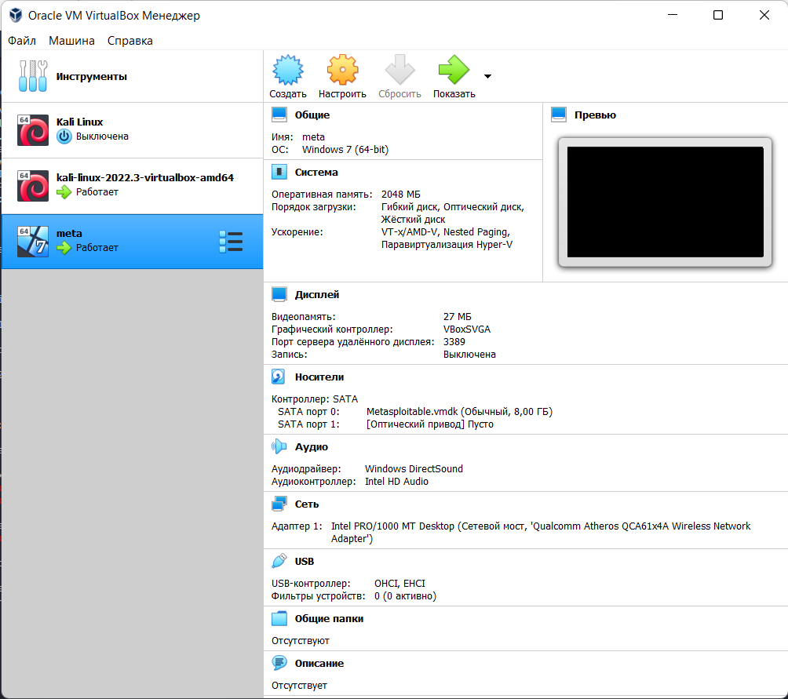
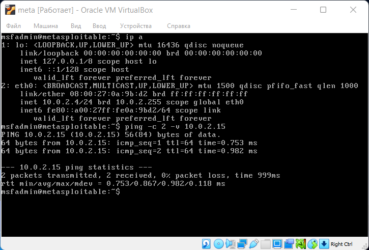
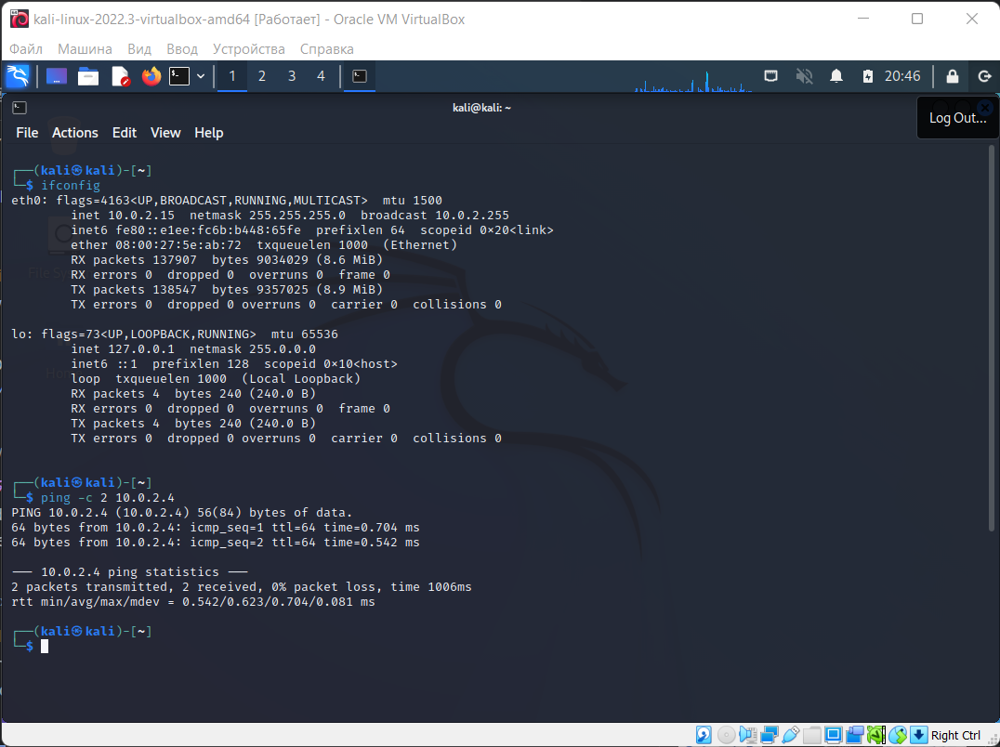

# Лабораторная работа № 1. Metasploit.

1. Необходимо установить предоставленную виртуальную машину metasploitable. 
2. Запустить Kali Linux и предоставленную ВМ и настроить между ними сеть (Пинг от одной машины должен доходить до другой
   и наоборот).  
3. С помощью nmap просканировать уязвимую машину. (P.S. лучше сохранить в отдельный файл результаты сканирования, будет
   проще работать с ним). [nmap](./nmap)
4. Выбрать уязвимый сервис и проэксплуатировать уязвимость с помощью Metasploit. Уязвимые сервисы не должны повторяться
   в рамках подгруппы.

```text
3632/tcp  open  distccd     distccd v1 ((GNU) 4.2.4 (Ubuntu 4.2.4-1ubuntu4))
6697/tcp  open  irc         UnrealIRCd
| irc-info:
|   users: 1
|   servers: 1
|   lusers: 1
|   lservers: 0
|   server: irc.Metasploitable.LAN
|   version: Unreal3.2.8.1. irc.Metasploitable.LAN
|   uptime: 0 days, 0:03:53
|   source ident: nmap
|   source host: C29CBC04.EB72D3BE.7B559A54.IP
|_  error: Closing Link: rnwbvdmmh[10.0.2.15] (Quit: rnwbvdmmh)
8787/tcp  open  drb         Ruby DRb RMI (Ruby 1.8; path /usr/lib/ruby/1.8/drb)
35808/tcp open  java-rmi    GNU Classpath grmiregistry
43243/tcp open  nlockmgr    1-4 (RPC #100021)
45249/tcp open  status      1 (RPC #100024)
54026/tcp open  mountd      1-3 (RPC #100005)
```

5. Составить отчет об эксплуатируемых уязвимостях и защитить его. В отчете должны быть скриншоты(либо файл) о
   сканировании, название порта, его описание, название уязвимости, её описание, скриншоты эксплуатации уязвимости.
6. Необходимо рассказать о службе, которая работает на выбранном порту (описать для чего она нужна как работает) и об
   эксплойте (на чем основывается, как работает).
   1. [disccd](./exploits/distccd(3632).md)
   2. [UnrealIRCd](./exploits/UnrealIRCd(6697).md)


